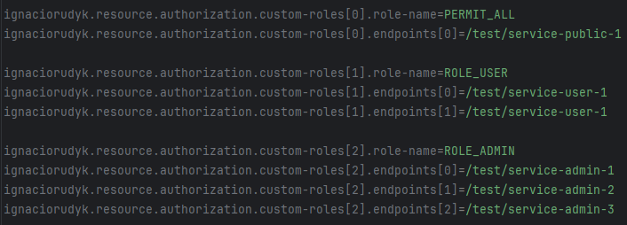

# ignaciorudyk-starter-resource-auth

`ignaciorudyk-starter-resource-auth` es un **Spring Boot Starter** que centraliza la configuración de autorización basada en JWT para aplicaciones desarrolladas con Spring Boot y Spring Security.

Su objetivo es evitar duplicar la configuración de seguridad en cada microservicio, proporcionando una implementación reutilizable para la validación de tokens JWT y la protección de endpoints.

## Características

* Validación de tokens JWT.
* Configuración automática de Spring Security.
* Integración sencilla mediante Maven.
* Configuración de reglas de acceso desde `application.properties`.
* Compatible con Spring Boot 3.x y Java 21.

## Requisitos

* Java 21
* Spring Boot 3.3+
* Maven 3.9+

## Cómo correr localmente

### Requisitos
Tener instalado JDK 21, GIT y Maven.

Descargar el proyecto:

`git clone https://github.com/ignacio-rudyk/ignaciorudyk-starter-resource-auth`

En una terminal dirigirse a la raiz del proyecto e instalar la dependencia en el repositorio local:

`mvn clean install`

Luego crear un proyecto Spring Boot que será el consumidor de la dependencia.

En el nuevo proyecto agregar la siguiente dependencia al pom.xml:

```xml
<dependency>
    <groupId>com.ignaciorudyk.resource.authorization</groupId>
    <artifactId>ignaciorudyk-starter-resource-auth</artifactId>
    <version>1.0.0</version>
</dependency>
```

## Configuración

El starter permite definir los endpoints y sus reglas de acceso desde la configuración de la aplicación.

### Ejemplo de configuracion de roles y endpoints



### Propiedades configurables en el proyecto consumidor

En el archivo application.properties agregue si es necesario las siguientes properties:

| Propiedad                                                                  | Descripción                                                                     | Obligatorio |
|----------------------------------------------------------------------------|---------------------------------------------------------------------------------|-------------|
| ignaciorudyk.resource.authorization.enabled                                | Habilita o deshabilita la dependencia (por defecto es true).                    | No          |
| ignaciorudyk.resource.authorization.secret-key                             | Secret key.                                                                     | Sí          |
| ignaciorudyk.resource.authorization.custom-roles[index1].role-name         | Configure un endpoint.                                                          | No          |
| ignaciorudyk.resource.authorization.custom-roles[index1].endpoints[index2] | Configure una ruta.                                                             | No          |
| ignaciorudyk.resource.authorization.allowed-origins[index]                 | Configure qué dominios pueden consumir tu API.                                  | No          |
| ignaciorudyk.resource.authorization.allowed-methods[index]                 | Configure qué métodos HTTP están permitidos desde otros orígenes.               | No          |
| ignaciorudyk.resource.authorization.allowed-headers[index]                 | Configure qué encabezados (headers) puede enviar el navegador al backend.       | No          |
| ignaciorudyk.resource.authorization.exposed-headers[index]                 | Configure qué headers de la respuesta el navegador puede leer desde JavaScript. | No          |

En una terminal dirigirse a la carpeta raiz del proyecto consumidor y ejecutar:

`mvn clean package`

Luego dirigirse a la carpeta `target` y ejecutar el .jar contenido con el siguiente comando:

`java -jar mi-app.jar`.

La API queda disponible en `http://localhost:8080`

## Estructura del proyecto

```
 src/main/
 ├── java/com/ignaciorudyk/resource/auth/
 │   ├── autoconfigure/
 │   │   └── AuthAutoConfiguration.java
 │   │
 │   ├── config/
 │   │   ├── security/
 │   │   │   ├── SecurityAutoConfiguration.java
 │   │   │   ├── SecurityCustomizer.java
 │   │   │   └── SecurityFilterChainAutoConfiguration.java
 │   │   ├── CustomRole.java
 │   │   ├── JwtAuthenticationFilter.java
 │   │   └── StarterResourceAuthProperties.java
 │   │
 │   ├── dto/
 │   │   └── response/
 │   │       ├── ErrorDTO.java
 │   │       ├── MetadataDTO.java
 │   │       ├── ResponseDTO.java
 │   │       └── UserInfoDTO.java
 │   │
 │   ├── exception/
 │   │   ├── handler/
 │   │   │   ├── GlobalExceptionHandler.java
 │   │   │   ├── JwtAccessDeniedHandler.java
 │   │   │   └── JwtAuthEntryPointHandler.java
 │   │   ├── InvalidTokenException.java
 │   │   └── ResourceAuthorizationException.java
 │   │
 │   ├── service/
 │   │   ├── implementation/
 │   │   │   └── JwtServiceImpl.java
 │   │   └── JwtService.java
 │   │
 │   └── util/
 │       └── HttpUtil.java
 │
 └── resources/
         ├── META-INF/
         │   └── spring/
         │       └── org.springframework.boot.autoconfigure.AutoConfiguration.imports
         └── application.properties
```

## Funcionamiento

El starter registra automáticamente la configuración de Spring Security y:

* Valida el token JWT recibido en cada petición protegida.
* Permite el acceso a los endpoints públicos configurados.
* Restringe el acceso al resto de los endpoints según las reglas definidas.
* Deja la lógica de negocio completamente desacoplada de la configuración de seguridad.

## Casos de uso

Este starter está pensado para ecosistemas de microservicios donde múltiples aplicaciones comparten el mismo mecanismo de autorización basado en JWT.

## Estado del proyecto

🚧 Proyecto en desarrollo.

La documentación y las opciones de configuración se irán ampliando conforme evolucione el starter.
